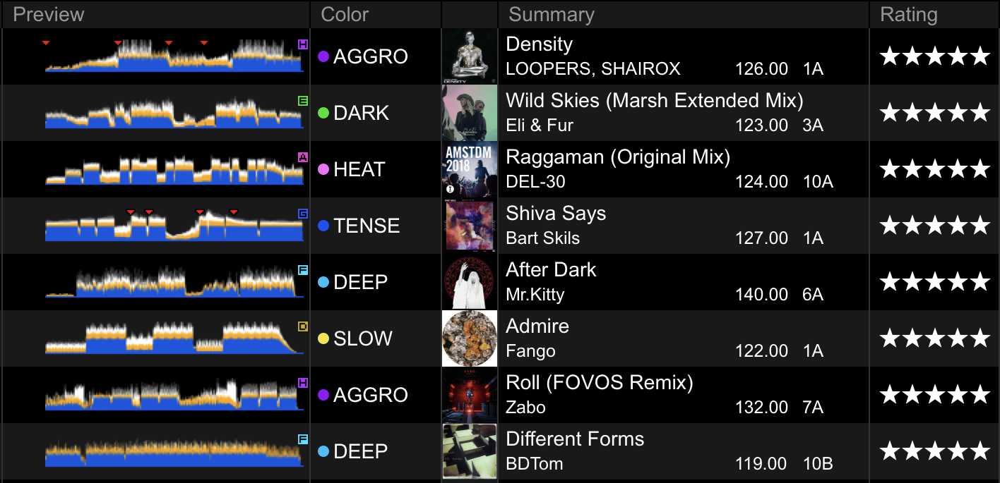

Rekordbox Hot Cue Tagger
--

Options (configure variables in index.js)
- Convert hot cues to track colors
- Convert track colors to colored waveform cues at TotalTime - 0.01
  - If disabled, TotalTime - 0.01 cues will be deleted
- Randomizes genre (sort by Genre for random track order)

Note: this removes typical hot cue functionality

Usage
--

1. Run `yarn` to install dependencies (install yarn if you don't have it)

2. (Optional) Modify index.js `shouldMapCuesToColor, shouldMapColorToCues, shouldRandomizeGenre, shouldFormatXML` as appropriate

3. Export `"rekordbox.xml"` into this directory and run `node index.js` or `node index.js && cp rekordbox-tagged.xml __SOME_LOCATION__`

4. Set rekordbox-tagged.xml in RB preferences -> advanced -> 'database location'

5. Refresh rekordbox.xml in sidebar

6. Sort rekordbox.xml All Tracks (not Playlists) by Color

7. Select tracks -> right click -> import to collection ("yes" if prompted)
